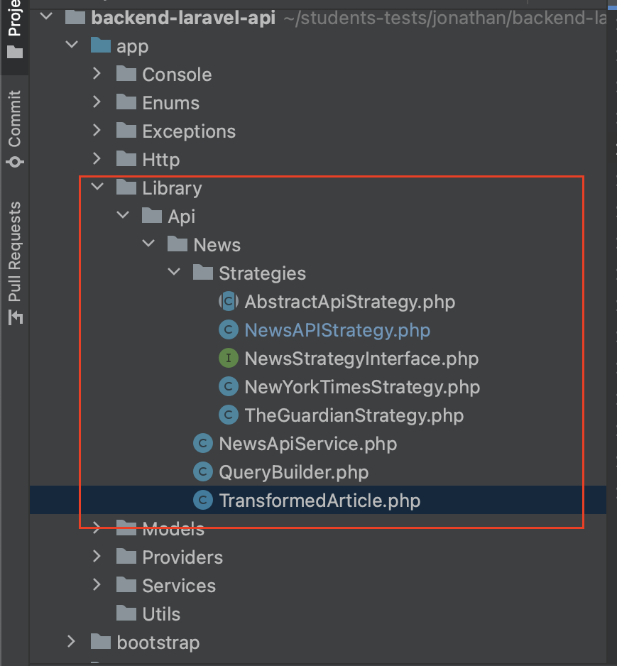

<h1 align="center">
  News Feed App
</h1>

## 🚀 Demo

<p align="left">
    <a href="https://carreiradesenvolvedor.github.io/react-news-app/" target="_blank"><b>Clique here to see a Live Demo</b></a>
</p>

## 🛠️ Installation Steps

1. Clone the repository

```bash
git clone https://github.com/carreiraDesenvolvedor/backend-laravel-api.git
```

2. Change the working directory

```bash
cd backend-laravel-api
```

3. Install dependencies

```bash
php composer.phar install
```

4. Setup the .env file and application key

```bash
 cp .env.example .env
 php artisan key:generate
```

5. Run the Containers(Using Sail)

```bash
./vendor/bin/sail up
```

5. Open a new terminal to generate the JWT Secret

```bash
  #Only run this command if you are not inside the project folder after opened a new terminal
  cd backend-laravel-api

  #creating the JWT Secret
  ./vendor/bin/sail php artisan jwt:secret
```

🌟 You are all set the api is running over the port 80!

## 💬️ How the APIs were used

<h4>API's being used</h4>
<ul>
    <li>
        <a target="_blank" href="https://newsapi.org/">News API</a>
    </li>
    <li>
        <a target="_blank" href="https://developer.nytimes.com/apis">News York Times</a>
    </li>
    <li>
        <a target="_blank" href="https://open-platform.theguardian.com/documentation/">The Guardian</a>
    </li>
</ul>

<h4>How are the apis being requested?</h4>
<p>
    To make the code more reusable, simpler to maintain and make it easy to add a new API I decided to implement the Design Partner Strategy/Factory.
</p>
<p>
    An interface(NewsAPIStrategy.php) for the APIs was created that contains the fields that are common between the APIs, creating a standard for consuming an API.
</p>
<p>
    An Abstract class(AbstractApiStrategy.php) was created implementing this interface to centralize the business rules will be made by all APIs.
</p>
<p>
    Each API must extend from this abstract class and implement the specific features of each API.
</p>

<h4>Strategy Example(NewsAPIStrategy.php)</h4>

```
<?php

namespace App\Library\Api\News\Strategies;

use App\Library\Api\News\TransformedArticle;
use Illuminate\Support\Arr;

class NewsAPIStrategy extends  AbstractApiStrategy {

    ...

    public function getAuthKey(): string
    {
        return '5e5b74d55a4148bea24f7c00b1422c61';
    }

    public function getPageQueryKey(): string
    {
        return 'page';
    }

    public function getKeywordQueryKey(): string
    {
        return 'q';
    }

    public function getFromDateQueryKey(): string
    {
        return 'from';
    }

    public function getEndpointURL(): string
    {
        return 'https://newsapi.org/v2/everything';
    }

    ...
}

```

<p>
    A class(QueryBuilder.php) was created to encapsulate the search-related business rules for each api.
</p>

<p>
    And last but not least, a class(TransformedArticle.php) was created to encapsulate the results of all APIs and standardize in our system.And last but not least, a class was created to encapsulate the results of all APIs and standardize in our system.
Where the only thing each APIStrategy needs to do is return results based on that class.
</p>

<h4>Example Strategy transforming the Results(NewsAPIStrategy.php)</h4>

```
<?php

namespace App\Library\Api\News\Strategies;

use App\Library\Api\News\TransformedArticle;
use Illuminate\Support\Arr;

class NewsAPIStrategy extends  AbstractApiStrategy {

    ...

    /**
     * @param $response
     * @return TransformedArticle[]
     */
    public function transformResponse($response): array
    {
        if(Arr::get($response, 'status') !== 'ok')
            return [];

        $result = [];
        foreach(Arr::get($response, 'articles') as $article){
            $transformedArticle = new TransformedArticle();
            $transformedArticle->setSource(Arr::get($article, 'source.name'), Arr::get($article, 'source.id'));
            $transformedArticle->setAuthor(Arr::get($article, 'author'));
            $transformedArticle->setTitle(Arr::get($article, 'title'));
            $transformedArticle->setDescription(Arr::get($article, 'description'));
            $transformedArticle->setUrlArticle(Arr::get($article, 'url'));
            $transformedArticle->setUrlThumbnail(Arr::get($article, 'urlToImage'));
            $transformedArticle->setPublishedAt(Arr::get($article, 'publishedAt'));

            $result[] = $transformedArticle->__toArray();
        }

        return $result;
    }

   ...
}

```

### Folder Structure

<p align="center"></p>

## 💻 Built with

-   [Laravel](https://laravel.com/docs/10.x)
-   [Mysql](https://www.mysql.com/): For Database
-   [Laravel Sail](https://laravel.com/docs/10.x/sail): For Docker Containerization

<hr>
<p align="center">
Developed by Jonathan Melo
</p>
